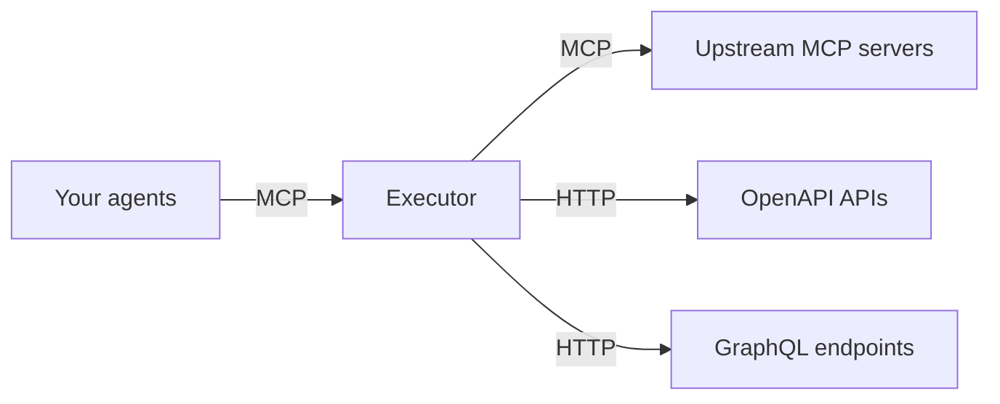

Executor sits between your agents and your tools as a single MCP endpoint. Your
agents connect to Executor; Executor connects out to your integrations and
re-exposes them as one catalog. Every tool call passes through the proxy, which is
where auth and policy live.

## Why proxy through Executor

- **One endpoint, every agent.** Point Claude Code, Cursor, ChatGPT, or your own
  SDK at the same Executor endpoint instead of configuring each tool in each client.
- **Credentials stay out of the agent.** A [connection](/concepts/connections)'s
  credentials are stored by Executor and attached to the upstream call. The agent
  runs in a sandbox and never sees them.
- **Per-tool policies.** Every call is governed by a [policy](/concepts/policies):
  allow, require approval, or block.
- **Mix [integration types](/concepts/integrations).** Upstream MCP servers, OpenAPI
  specs, and GraphQL endpoints all show up in the same catalog.

## How it works

Agents speak MCP to Executor. For each tool call, Executor picks the right
integration, attaches that connection's credentials to the upstream request,
enforces the tool's policy, and returns the result. The agent only ever talks to
Executor, and the credentials never reach it.

## Proxy an upstream MCP server

Add an MCP server as an [integration](/concepts/integrations) and its tools join
your catalog alongside everything else. Create a [connection](/concepts/connections)
to it (with credentials if it needs them), and it becomes reachable through your one
Executor endpoint, governed by the same policies as the rest of your tools.

This is the core of the proxy: your agents keep talking to a single endpoint while
you add, swap, or remove upstream servers behind it, with no client-side change.

## Connect your agents

Agents connect to Executor's MCP endpoint. The exact command depends on how you run
Executor:

- **Local:** see [CLI](/local/cli) for `executor mcp` and the `add-mcp` command.
- **Hosted:** see [Executor Cloud](/hosted/cloud), or self-host on
  [Docker](/hosted/docker) or [Cloudflare](/hosted/cloudflare).

Once a client is connected, every integration you add to Executor appears in that
agent automatically.
